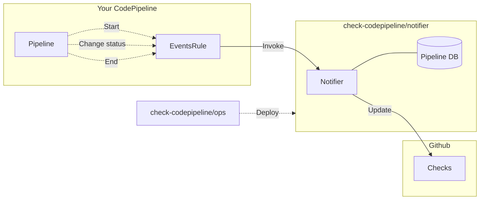

# checks-codepipeline

Write CodePipeline status to GitHub checks

# Deploy

1. Install GitHub apps, and get `App ID`, `Installation ID` and `Private key`
1. Store `Private Key` as SecureString in AWS SSM parameters
1. Build and deploy

```sh
cd notifier
sam build
sam deploy -g
```

# Use

Add the following resources to your pipeline

```yaml
Parameters:
  PipelineName:         # Your pipeline name
    Type: String
  NotifierFunctionArn:  # Output of notifier stack
    Type: String

Resources:
  EventsRule:
    Type: AWS::Events::Rule
    Properties
      EventPattern:
        source:
          - aws.codepipeline
        region:
          - !Ref AWS::Region
        account:
          - !Ref AWS::AccountId
        detail-type:
          - "CodePipeline Pipeline Execution State Change"
          - "CodePipeline Action Execution State Change"
        detail:
          pipeline:
            - !Ref Pipeline
          state:
            - STARTED
            - SUCCEEDED
            - FAILED
            - CANCELED
      Targets:
        Id: ChecksCodepipelineNotifier
        Arn: !Ref NotifyFunctionArn
```

# Development

## Tables

### PipelineDB

|Name       |Type|Key|   |
|-----------|----|---|---|
|ExecutionId|S   |PK |   |
|Timestamp  |N   |   |   |
|CheckRunId |N   |   |   |
|Expired    |N   |   |TTL|

## Structure


